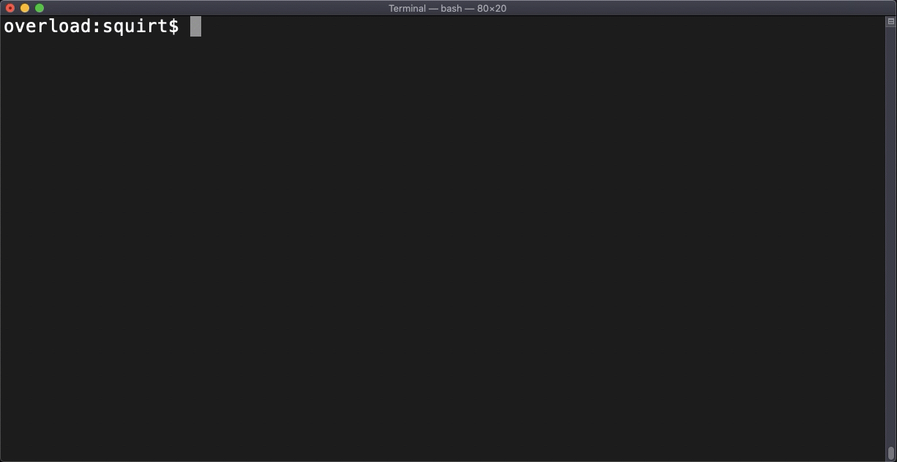
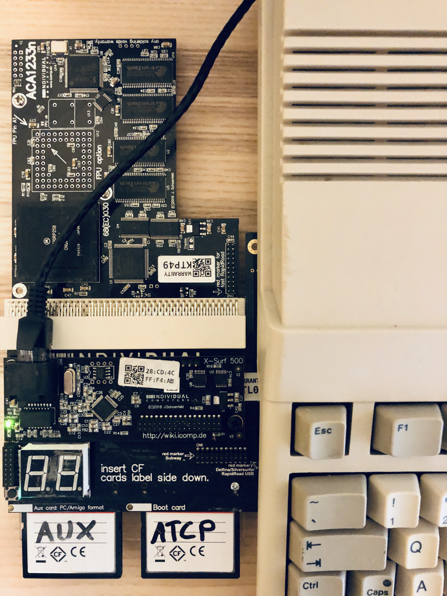

# squirt - Transfer files from modern computers to Amiga via TCP/IP

Push files quickly from a modern computer to an Amiga. `squirtd` is designed to be super small, use hardly any ram and transfer files as fast as possible. The Amiga `squirtd` executable is about `3.5Kb`.

:radioactive::warning::no_entry: Please don't run `squirtd` on any computer that is connected to the open internet!!! :no_entry::warning::radioactive:

There are no passwords, no server side validations and transfers are plain text. To top it off it's written in C and the server code has `goto` statements! :stuck_out_tongue_closed_eyes:

## Usage

`squirtd` requires a destination folder argument where it will write any files that are squirted it's way.

    squirtd destination_folder

Note: `destination folder` must end with a valid directory separator character as the filename is simply appended to `destination folder`. 

For example:

    squirtd Work:Incoming/

## Running as a daemon

It's easy to run `squirtd` on your Amiga as a background daemon, just start it from your TCP/IP stack's startup script. `squirtd` should gracefully exit when your TCP/IP stack exits.

### AmiTCP
Add the following to AmiTCP:db/User-Startnet.

    run >NIL: aux:squirtd Work:Incoming/
    
where `Work:Incoming/` is the destination folder you want `squirtd` to write files.
    
### Roadshow
Add the following to S:Network-Startup.

    run >NIL: aux:squirtd Work:Incoming/

where `Work:Incoming/` is the destination folder you want `squirtd` to write files.

## squirting a file

client usage is as follows:

    squirt filename hostname

See below for a demo of squirting a 5mb file from a mac to my real Amiga 500 with an XSurf-500.

