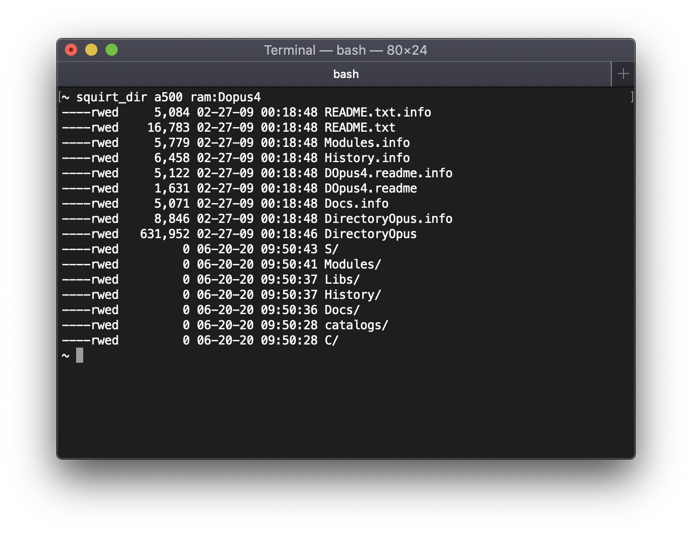

# squirt - Remotely manage your Amiga over TCP/IP from modern systems

`squirtd` is a small server (the executable is less than 5kb) that lets you remotely manage your Amiga over TCP/IP using set of command lines tools running on a modern system.

You can:
 * Send (squirt) files
 * Recieve (suck) files
 * Run non interactive commands
 * List directories
 * Perform incremental backups
 * Run a remote cli
    * You can run (non interactive) commands remotely on your Amiga
    * You can run commands locally on your modern system
    * When you run commands locally they can easily access both Amiga and local files

:radioactive::warning::no_entry: Please don't run `squirtd` on any computer that is connected to the open internet!!! :no_entry::warning::radioactive:

There are no passwords, no server side validations and transfers are plain text. To top it off it's written in C and the server code has `goto` statements! :stuck_out_tongue_closed_eyes:

## Usage

`squirtd` requires a destination folder argument where it will write any files that are squirted it's way.

    squirtd destination_folder

Note: `destination folder` must end with a valid directory separator character as the filename is simply appended to `destination folder`.

For example:

    squirtd Work:Incoming/

## Running as a daemon

It's easy to run `squirtd` on your Amiga as a background daemon, just start it from your TCP/IP stack's startup script. `squirtd` should gracefully exit when your TCP/IP stack exits.

### AmiTCP
Add the following to AmiTCP:db/User-Startnet.

    run >NIL: aux:squirtd Work:Incoming/

where `Work:Incoming/` is the destination folder you want `squirtd` to write files.

### Roadshow
Add the following to S:Network-Startup.

    run >NIL: aux:squirtd Work:Incoming/

where `Work:Incoming/` is the destination folder you want `squirtd` to write files.

## Management commands

### squirting a file

    squirt hostname filename

### sucking a file

    squirt_suck hostname filename

### running a command

    squirt_exec hostname command and arguments

### remote cli
    squirt_cli hostname
    
Click on the image below to see a demo video of the remote shell in action.

### backing up

    squirt_backup hostname path_to_backup

### list directory

    squirt_dir hostname path

## License

Unless otherwise specified in the source file, all files are Copyright &copy; 2020 Enable Software Pty Ltd. All Rights Reserved.

This software is free software. You can redistribute it and/or modify it under the terms of the GNU General Public License as published by the Free Software Foundation; either version 3 of the License, or (at your option) any later version.

This software is distributed in the hope that it will be useful, but WITHOUT ANY WARRANTY; without even the implied warranty of MERCHANTABILITY or FITNESS FOR A PARTICULAR PURPOSE.

You should have received a copy of the GNU General Public License along with the software; see the file LICENSE.
