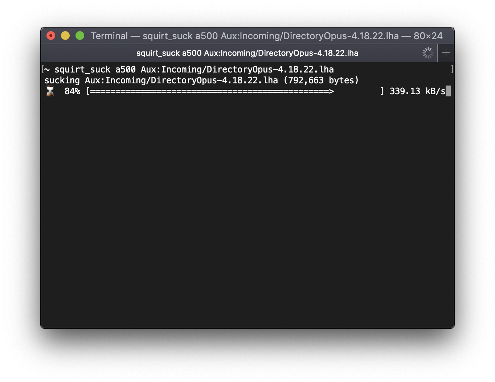
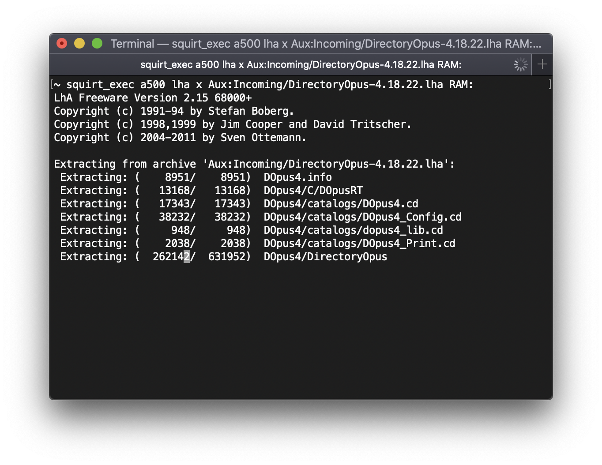
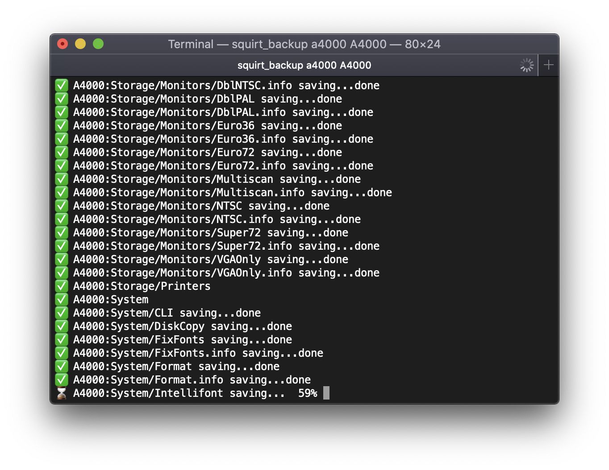

# squirt - Remotely manage Amigas via TCP/IP from modern systems

`squirtd` is a small server (the executable is less than 5kb) that lets you remotely manage your Amiga over TCP/IP using set of command lines tools running on a modern system.

You can:
 * Send (squirt) files
 * Recieve (suck) files
 * Run non interactive commands
 * Perform incremental backups

:radioactive::warning::no_entry: Please don't run `squirtd` on any computer that is connected to the open internet!!! :no_entry::warning::radioactive:

There are no passwords, no server side validations and transfers are plain text. To top it off it's written in C and the server code has `goto` statements! :stuck_out_tongue_closed_eyes:

## Usage

`squirtd` requires a destination folder argument where it will write any files that are squirted it's way.

    squirtd destination_folder

Note: `destination folder` must end with a valid directory separator character as the filename is simply appended to `destination folder`.

For example:

    squirtd Work:Incoming/

## Running as a daemon

It's easy to run `squirtd` on your Amiga as a background daemon, just start it from your TCP/IP stack's startup script. `squirtd` should gracefully exit when your TCP/IP stack exits.

### AmiTCP
Add the following to AmiTCP:db/User-Startnet.

    run >NIL: aux:squirtd Work:Incoming/

where `Work:Incoming/` is the destination folder you want `squirtd` to write files.

### Roadshow
Add the following to S:Network-Startup.

    run >NIL: aux:squirtd Work:Incoming/

where `Work:Incoming/` is the destination folder you want `squirtd` to write files.

## Management commands

## squirting a file

    squirt hostname filename

See below for a demo of squirting a 5mb file from a mac to my real Amiga 500 with an XSurf-500.

## sucking a file

    squirt_suck hostname filename
    

    
## running a command

    squirt_exec hostname command and arguments

## backing up

    squirt_backup hostname path_to_backup

